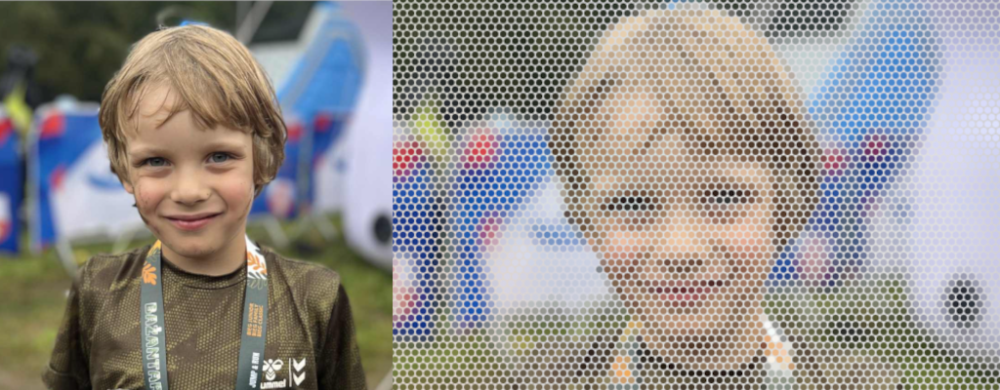

# Pixelator

A Rust library and CLI tool for converting images into SVG circle art suitable for poster printing.

## Features

- Convert any image to SVG with colored circles
- **NEW: Halftone/Stippling effect** - Create artistic black & white prints with variable dot sizes
- Control circle size and spacing
- Two sampling modes: Grid and Hexagonal
- Multiple render modes: Full color or monochrome halftone
- Specify output dimensions in millimeters for print-ready files
- Optional background color
- Efficient parallel processing with averaged color sampling

## Installation

```bash
cargo build --release
```

## CLI Usage

Basic usage:
```bash
pixelator input.jpg output.svg
```

With custom parameters:
```bash
# Large circles with more spacing
pixelator input.jpg output.svg -d 20 -s 5

# Hexagonal pattern
pixelator input.jpg output.svg -m hexagonal

# Specify print dimensions (A3 size)
pixelator input.jpg output.svg -w 297 -h 420

# Add white background
pixelator input.jpg output.svg -b white

# Halftone effect (black dots on white)
pixelator input.jpg output.svg -r halftone-black

# Halftone effect (white dots on black)
pixelator input.jpg output.svg -r halftone-white

# Custom halftone dot size range
pixelator input.jpg output.svg -r halftone-black --min-dot 0.5 --max-dot 15
```

### CLI Options

#### Basic Options
- `-d, --circle-diameter`: Circle diameter in pixels (default: 10.0)
- `-s, --circle-spacing`: Spacing between circles in pixels (default: 2.0)
- `-w, --width-mm`: Output width in millimeters
- `-h, --height-mm`: Output height in millimeters
- `-b, --background`: Background color (e.g., #FFFFFF or white)
- `-m, --mode`: Sampling mode - "grid" or "hexagonal" (default: grid)

#### Render Modes
- `-r, --render`: Render mode (default: color)
  - `color`: Full color circles (original mode)
  - `halftone-black`: Black dots on white background
  - `halftone-white`: White dots on black background
  
#### Halftone Options
- `--min-dot`: Minimum dot size for halftone mode
- `--max-dot`: Maximum dot size for halftone mode

## Library Usage

```rust
use pixelator::{Pixelator, PixelatorConfig};

fn main() -> Result<(), Box<dyn std::error::Error>> {
    // Create configuration
    let config = PixelatorConfig::new(10.0, 2.0)?
        .with_output_dimensions(297.0, 420.0)?  // A3 size in mm
        .with_background_color("white".to_string());
    
    // Create pixelator instance
    let pixelator = Pixelator::new(config);
    
    // Process image
    pixelator.process_image_to_file("input.jpg", "output.svg")?;
    
    Ok(())
}
```

## How It Works

1. The image is sampled at regular intervals based on circle diameter and spacing
2. Each sample point averages colors within the circle radius
3. An SVG is generated with circles at each sample point
4. The resulting SVG can be scaled to any print size

## Tips for Best Results

### Color Mode
- **For posters**: Use larger circle diameters (15-30 pixels) with moderate spacing (3-10 pixels)
- **For detailed prints**: Use smaller circles (5-10 pixels) with minimal spacing (1-3 pixels)
- **Hexagonal mode**: Provides more organic-looking results, especially for portraits
- **Grid mode**: Better for geometric or architectural images

### Halftone Mode
- **For artistic prints**: Use halftone mode to create stunning black & white artwork
- **Black on white**: Best for printing on white paper, darker areas have larger dots
- **White on black**: Best for dark backgrounds or inverted effects
- **Dot size range**: Experiment with min/max dot sizes for different artistic effects
  - Small range (1-5): Subtle shading, newspaper-like effect
  - Large range (0.5-15): High contrast, dramatic effect
  - Very large (1-30): Bold, pop-art style

### General Tips
- **Print dimensions**: Always specify output dimensions in millimeters for accurate printing
- **High contrast images**: Work best with halftone modes
- **Portraits**: Try hexagonal mode with halftone for magazine-style effects

## Example Results

- Input image resolution: 3000x2000 pixels
- Circle diameter: 20 pixels, Spacing: 5 pixels
- Result: ~120 x 80 circles
- Perfect for A2 poster printing

## License

MIT